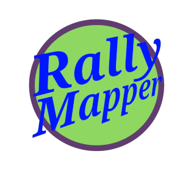

# Rally_Mapper : A Rally Course Generator

 / ! 

***

## Rally: A skill and strategy based time trial race  

> While it is possible to run a Rally on foot, These Tracks are specifically designed to take advantage of the  
> capability of a Rally Board or EUC. Which are handsfree operated, partially self balancing,  
> personal electric vehicles or P.E.V.s

***

A Rally Track is a **timed** course consisting of three components:

1. **A Course**  
2. **Obstacles**  
3. **and Punches**  

***

**The Track** can be linear or a loop. changed with a toggle on the main menu.  

***

**The Obstacles** are objects within the course that require the performance of certain riding skills in order to navigate successfully and even more skill to overcome at speed

***

**Punches** are triggered checkpoints located throughout the Track that, when activated, grant a bonus time reduction to your run.  

***

## A Track Generator and Time Calculator

Choose the type of map  
Choose the size of the map  
Choose your obstacles  

Rally Mapper will generate a custom Track, Place Obstacles and Punches, and provide the calculated time reductions gained from each.  

***

This Application was made using **Fyne** UI and **Go** programming language.
Track Data is stored locally in JSON format allowing for the eventual implementation
of an online database.  

It is intended to be the first part of a larger application that will run  
Rallys based on the Track information created with the Rally Mapper.  
Automatically calculating times and logging multiple runs for each contestant,  
as well as creating sharable videos of their performance.  

**This is a work in progress** There is a long list of missing features and potential updates, such as:

> 1. ~~animation updates to place obstacles and punches after track is placed~~
> 2. delete saves from within the app
> 3. pinch zoom and rotate the map smoothly
> 4. run the track animation that takes you through the course at the average speed.
> 5. ability to upload and share Tracks
> 6. Login and Multiple user support
> 7. manual obstacle and punch placement
> 8. Rally Mapper Mobile
> 9. minor UI improvements.

## Required to build app

1. Go Language: Fyne is built in Go, so you need a working Go installation. Version 1.17 or later is recommended.

2. C Compiler: Fyne utilizes CGo to interact with system graphics drivers (like GLFW for desktop platforms), which necessitates a C compiler.

3. OS specific :
    - Linux: GCC is typically suitable. You might also need libgl1-mesa-dev and xorg-dev packages on Debian/Ubuntu-based systems.
    - macOS: Xcode, which includes the necessary command-line tools, provides the C compiler.
    - Windows: Options include MSYS2 with MingW-w64, TDM-GCC, or Cygwin.

4. System Graphics Driver: Fyne relies on your system's graphics driver to render the UI. This is typically handled by the C compiler and associated libraries.  

**Optional but Recommended:**
fyne.io/fyne/v2: The Fyne toolkit itself, which you install using go get fyne.io/fyne/v2@latest.  
Fyne Setup tool: A utility to check your development environment and assist with troubleshooting.  
fyne-cross: For cross-compiling your Fyne application to different platforms, particularly useful for mobile and other OS targets from a single development machine.
